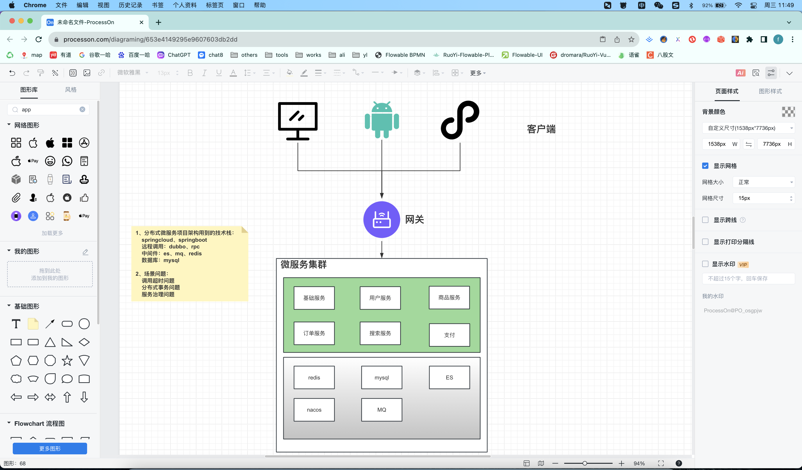
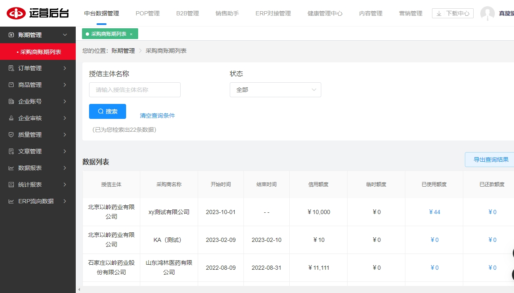
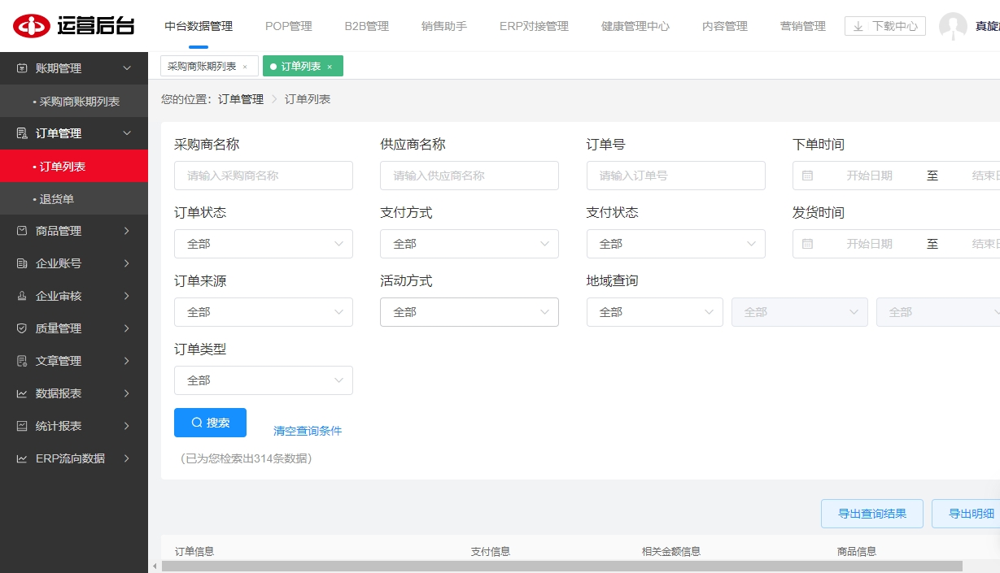
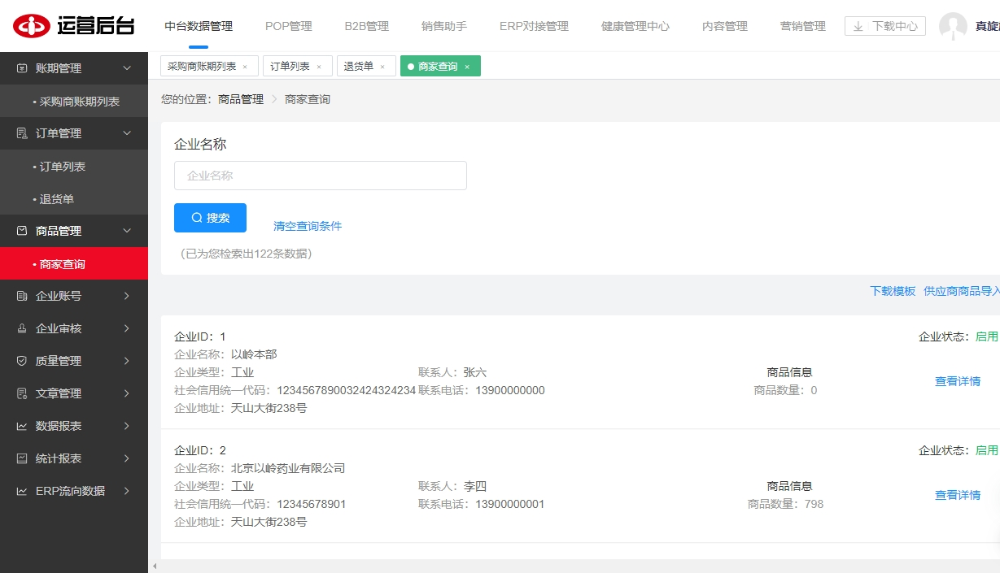
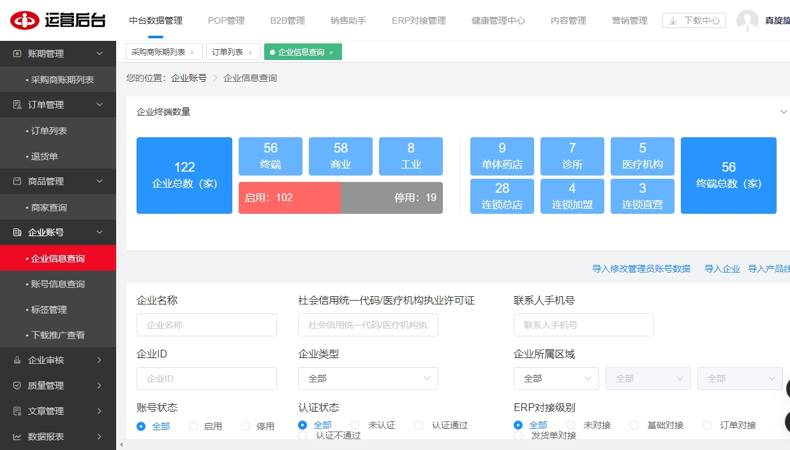
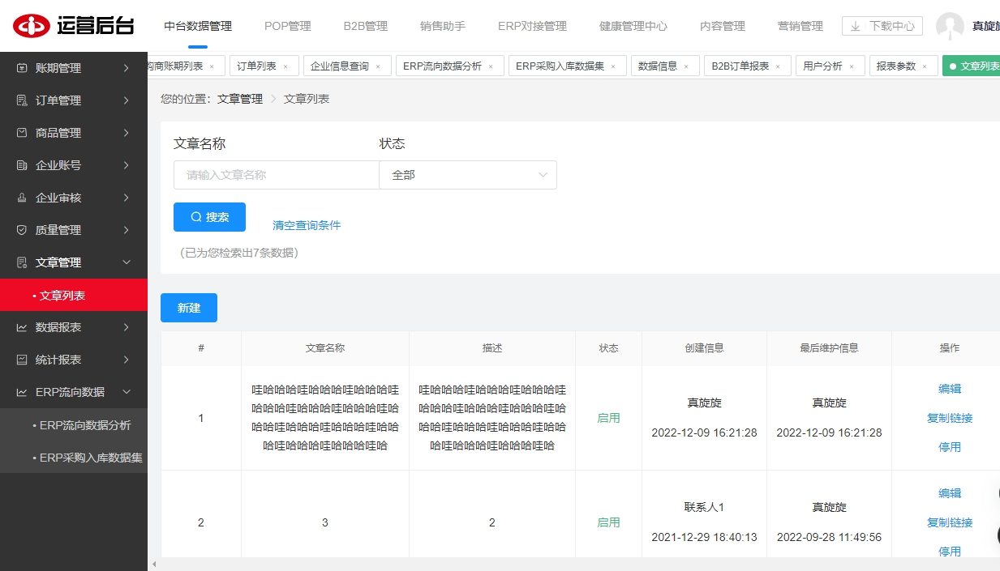

<p align="center">
    <a href='https://docs.oracle.com/en/java/javase/8'></a>
    <a href='https://docs.spring.io/spring-boot/docs/2.6.2-SNAPSHOT/reference/html'></a>
    <a href='https://staging-cn.vuejs.org'></a><br/>
    <a href='#'></a>
    <a href='#'></a>
    <a href='#'></a>
    <a href='#'></a>
</p>

# 以岭药业

### 项目描述



### 开发环境

+ Windows

### 配置环境

| 程序           | 版本        | 说明                       |
|--------------|-----------|--------------------------|
| Jdk          | 1.8.0 161 | Java 开发工具包               |
| Mysql        | 5.5.27    | 关系型数据库                   |
| Redis        | 7.0.5     | 非关系型数据库                  |
| Apache-maven | 3.9.0     | Java 项目管理和构建工具           |
| Nvm          | 1.10      | Node.js 版本管理器            |
| Node         | 14.21.3   | Node.js JavaScript 运行时环境 |

### 开发工具

| 工具                       | 版本            | 说明                      |
|--------------------------|---------------|-------------------------|
| IDEA                     | 2022.3.2      | 后前端开发IDE                |
| Git                      | 2.24.1        | 代码托管平台                  |
| Google   Chrome          | 75.0.3770.100 | 浏览器、前端调试工具              |
| Navicat                  | 11.1.13       | 数据库连接工具                 |
| Postman                  | 7.1.0         | 接口测试工具                  |
| VMware   Workstation Pro | 14.1.3        | 虚拟机(未用到或许你会用到)          |
| PowerDesigner            | 15            | 数据库设计工具(未用到或许你会用到)      |
| SQLyog                   | 12.0.3        | 数据库连接工具 (未用到或许你会用到)     |
| Visio                    | 2013          | 时序图、流程图等绘制工具(未用到或许你会用到) |
| ProcessOn                | ——            | 架构图等绘制工具(未用到或许你会用到)     |
| XMind   ZEN              | 9.2.0         | 思维导图绘制工具(未用到或许你会用到)     |
| RedisDesktop             | 0.9.3.817     | redis客户端连接工具(未用到或许你会用到) |

###  编码规范

- 规范方式：严格遵守阿里编码规约。
- 命名统一：简介最大程度上达到了见名知意。
- 分包明确：层级分明可快速定位到代码位置。
- 注释完整：描述性高大量减少了开发人员的代码阅读工作量。
- 工具规范：使用统一jar包避免出现内容冲突。
- 代码整洁：可读性、维护性高。

### 包的结构

```
+- yiling-web -- 项目前端
|   +- .env.development -- 开发环境的环境变量配置文件。
|   +- .env.development.local -- 本地开发环境的环境变量配置文件。
|   +- .env.production -- 生产环境的环境变量配置文件。
|   +- .env.testing -- 测试环境的环境变量配置文件。
|   +- .env.testing.local -- 本地测试环境的环境变量配置文件。
|   +- .eslintignore -- ESLint忽略文件配置。
|   +- .eslintrc.js -- ESLint配置文件。
|   +- .gitignore -- Git忽略文件配置。
|   +- alias.config.js -- Webpack别名配置文件。
|   +- babel.config.js -- Babel配置文件。
|   +- build -- 存放构建脚本的目录。
|   +- config -- 存放配置文件的目录。
|   +- index.html -- 项目首页。
|   +- jest.config.js -- Jest测试框架配置文件。
|   +- jsconfig.json -- JavaScript配置文件。
|   +- node_modules -- 存放项目依赖的目录。
|   +- package-lock.json -- 锁定安装时的包的版本号。
|   +- package.json -- 项目依赖和脚本信息。
|   +- plop-templates -- Plop模板目录。
|   |   +- component -- 组件模板目录。
|   |   +- store -- 状态管理模板目录。
|   |   +- utils.js -- 工具函数模板文件。
|   |   +- view -- 视图模板目录。
|   +- plopfile.js -- Plop配置文件。
|   +- postcss.config.js -- PostCSS配置文件。
|   +- public -- 存放公共资源的目录。
|   +- README.md -- 项目说明文件。
|   +- serve.js -- 开发环境服务启动脚本。
|   +- src -- 存放源代码的目录。
|   |   +- common -- 公共资源目录。
|   |   |   +- assets -- 存放静态资源的目录。
|   |   |   +- components -- 存放组件的目录。
|   |   |   +- directive -- 存放自定义指令的目录。
|   |   |   +- filters -- 存放过滤器的目录。
|   |   |   +- mixins -- 存放混入对象的目录。
|   |   |   +- package -- 存放第三方库
|   |   |   +- styles -- 存放样式文件的目录。
|   |   |   +- utils -- 存放工具函数的目录。
|   |   |   +- views -- 存放视图文件的目录。
|   |   +- subject -- 存放主题文件的目录。
|   |   |   +- .DS_Store -- 主题文件缓存文件。
|   |   |   +- admin -- 存放后台管理相关文件的目录。
|   |   |   |   +- api -- 存放后台管理API相关文件的目录。
|   |   |   |   +- App.vue -- 后台管理入口文件。
|   |   |   |   +- assets -- 存放后台管理静态资源的目录。
|   |   |   |   +- busi -- 存放后台管理业务相关文件的目录。
|   |   |   |   +- components -- 存放后台管理组件的目录。
|   |   |   |   +- directive -- 存放后台管理自定义指令的目录。
|   |   |   |   +- filters -- 存放后台管理过滤器的目录。
|   |   |   |   +- icons -- 存放后台管理图标的目录。
|   |   |   |   +- layout -- 存放后台管理布局文件的目录。
|   |   |   |   +- main.js -- 后台管理入口文件。
|   |   |   |   +- permission.js -- 后台管理权限文件。
|   |   |   |   +- router -- 后台管理路由文件的目录。
|   |   |   |   +- settings.js -- 后台管理设置文件。
|   |   |   |   +- store -- 后台管理状态管理文件的目录。
|   |   |   |   +- styles -- 存放后台管理样式文件的目录。
|   |   |   |   +- utils -- 存放后台管理工具函数的目录。
|   |   |   |   +- views -- 存放后台管理视图文件的目录。
|   |   |   |   +- views_b2b -- 存放后台管理B2B视图文件的目录。
|   |   |   |   +- views_cmp -- 存放后台管理CMP视图文件的目录。
|   |   |   |   +- views_content -- 存放后台管理内容视图文件的目录。
|   |   |   |   +- views_marketing -- 存放后台管理营销视图文件的目录。
|   |   |   |   +- views_sale -- 存放后台管理销售视图文件的目录。
|   |   |   |   +- views_zt -- 存放后台管理专题视图文件的目录。
|   |   |   +- pop -- 存放弹窗相关文件的目录。
|   +- vue.config.js --  Vue项目的配置文件
+- yiling-platform -- 项目后端
|   +- .git -- Git版本控制目录。
|   +- .idea -- IntelliJ IDEA配置目录。
|   +- yiling-framework -- 框架目录。
|   |   +- yiling-common -- 存放通用代码的目录。
|   |   +- yiling-core -- 存放核心代码的目录。
|   |   +- yiling-es-client -- 存放Elasticsearch客户端代码的目录。
|   |   +- yiling-generator -- 存放代码生成器的目录。
|   |   +- yiling-oss-client -- 存放OSS客户端代码的目录。
|   |   +- yiling-parent -- 存放父级Maven项目的目录。
|   |   +- yiling-rocketmq -- 存放RocketMQ客户端代码的目录。
|   +- yiling-job -- 存放任务调度相关代码的目录。
|   |   +- yiling-job-executor -- 存放任务执行器代码的目录。
|   +- yiling-portal-group -- 存放门户网站相关代码的目录。
|   |   +- yiling-admin-portal -- 存放后台管理门户网站相关代码的目录。
|   |   |   +- yiling-admin-b2b-web -- 存放B2B后台管理门户网站相关代码的目录。
|   |   |   +- yiling-admin-cms-web -- 存放CMS后台管理门户网站相关代码的目录。
|   |   |   +- yiling-admin-common -- 存放后台管理门户网站通用代码的目录。
|   |   |   +- yiling-admin-data-center-web -- 存放数据中心后台管理门户网站相关代码的目录。
|   |   |   +- yiling-admin-erp-web -- 存放ERP后台管理门户网站相关代码的目录。
|   |   |   +- yiling-admin-gateway -- 存放后台管理门户网站网关相关代码的目录。
|   |   |   +- yiling-admin-hmc-web -- 存放HMC后台管理门户网站相关代码的目录。
|   |   |   +- yiling-admin-pop-web -- 存放POP后台管理门户网站相关代码的目录。
|   |   |   +- yiling-admin-sales-assistant-web -- 存放销售助手后台管理门户网站相关代码的目录。
|   |   |   +- yiling-admin-system-web -- 存放系统后台管理门户网站相关代码的目录。
|   |   +- yiling-hmc-portal -- 存放HMC门户网站相关代码的目录。
|   |   |   +- yiling-hmc-gateway -- 存放HMC门户网站网关相关代码的目录。
|   |   |   +- yiling-hmc-web -- 存放HMC门户网站相关代码的目录。
|   |   +- yiling-mall-portal -- 存放商城门户网站相关代码的目录。
|   |   |   +- yiling-activity-web -- 存放活动门户网站相关代码的目录。
|   |   |   +- yiling-b2b-admin-web -- 存放B2B商城后台管理门户网站相关代码的目录。
|   |   |   +- yiling-b2b-app-web -- 存放B2B商城APP门户网站相关代码的目录。
|   |   |   +- yiling-b2b-web -- 存放B2B商城门户网站相关代码的目录。
|   |   |   +- yiling-data-center-admin-web -- 存放数据中心商城后台管理门户网站相关代码的目录。
|   |   |   +- yiling-f2b-admin-web -- 存放F2B商城后台管理门户网站相关代码的目录。
|   |   |   +- yiling-f2b-app-web -- 存放F2B商城APP门户网站相关代码的目录。
|   |   |   +- yiling-f2b-web -- 存放F2B商城门户网站相关代码的目录。
|   |   |   +- yiling-hmc-admin
|   |   |   +- yiling-hmc-admin-web -- HMC后台管理门户网站相关代码的目录。
|   |   |   +- yiling-mall-common -- 商城门户网站通用代码的目录。
|   |   |   +- yiling-mall-gateway -- 商城门户网站网关相关代码的目录。
|   |   |   +- yiling-payment-web -- 商城门户网站支付相关代码的目录。
|   |   |   +- yiling-sales-assistant-admin-web -- 销售助手后台管理门户网站相关代码的目录。
|   |   |   +- yiling-user-web -- 商城门户网站用户相关代码的目录。
|   |   +- yiling-open-portal -- 开放平台门户网站相关代码的目录。
|   |   |   +- yiling-open-cms-web -- 开放平台CMS门户网站相关代码的目录。
|   |   |   +- yiling-open-common -- 开放平台门户网站通用代码的目录。
|   |   |   +- yiling-open-gateway -- 开放平台门户网站网关相关代码的目录。
|   |   |   +- yiling-open-web -- 开放平台门户网站相关代码的目录。
|   |   +- yiling-sales-assistant-app-portal -- 销售助手APP门户网站相关代码的目录。
|   |   |   +- yiling-sales-assistant-app-gateway -- 销售助手APP门户网站网关相关代码的目录。
|   |   |   +- yiling-sales-assistant-app-mr-web -- 销售助手APP门户网站MR相关代码的目录。
|   |   |   +- yiling-sales-assistant-app-web -- 销售助手APP门户网站相关代码的目录。
|   |   |   +- yiling-sales-assistant-common -- 销售助手APP门户网站通用代码的目录。
|   |   +- yiling-sjms-portal -- 商家秘书门户网站相关代码的目录。
|   |   |   +- yiling-sjms-gateway -- 商家秘书门户网站网关相关代码的目录。
|   |   |   +- yiling-sjms-web -- 商家秘书门户网站相关代码的目录。
|   |   +- yiling-sync-tools -- 同步工具相关代码的目录。
|   +- yiling-service-group -- 存放服务相关代码的目录。
|   |   +- yiling-basic-service -- 存放基础服务相关代码的目录。
|   |   |   +- yiling-basic-api -- 存放基础服务API相关代码的目录。
|   |   |   +- yiling-basic-provider -- 存放基础服务提供者相关代码的目录。
|   |   +- yiling-bi-service -- 存放BI服务相关代码的目录。
|   |   |   +- yiling-bi-api -- 存放BI服务API相关代码的目录。
|   |   |   +- yiling-bi-provider -- 存放BI服务提供者相关代码的目录。
|   |   +- yiling-cms-service -- 存放CMS服务相关代码的目录。
|   |   |   +- yiling-cms-api -- 存放CMS服务API相关代码的目录。
|   |   |   +- yiling-cms-provider -- 存放CMS服务提供者相关代码的目录。
|   |   +- yiling-dataflow-service -- 存放数据流服务相关代码的目录。
|   |   |   +- yiling-dataflow-api -- 存放数据流服务API相关代码的目录。
|   |   |   +- yiling-dataflow-provider -- 存放数据流服务提供者相关代码的目录。
|   |   +- yiling-export-service -- 存放导出服务相关代码的目录。
|   |   |   +- yiling-export-api -- 存放导出服务API相关代码的目录。
|   |   |   +- yiling-export-provider -- 存放导出服务提供者相关代码的目录。
|   |   +- yiling-goods-service -- 存放商品服务相关代码的目录。
|   |   |   +- yiling-goods-api -- 存放商品服务API相关代码的目录。
|   |   |   +- yiling-goods-provider -- 存放商品服务提供者相关代码的目录。
|   |   +- yiling-hmc-service -- 存放HMC服务相关代码的目录。
|   |   |   +- yiling-hmc-api -- 存放HMC服务API相关代码的目录。
|   |   |   +- yiling-hmc-provider -- 存放HMC服务提供者相关代码的目录。
|   |   +- yiling-ih-service -- 存放IH服务相关代码的目录。
|   |   |   +- yiling-ih-api -- 存放IH服务API相关代码的目录。
|   |   |   +- yiling-ih-provider -- 存放IH服务提供者相关代码的目录。
|   |   +- yiling-mall-service -- 存放商城服务相关代码的目录。
|   |   |   +- yiling-mall-api -- 存放商城服务API相关代码的目录。
|   |   |   +- yiling-mall-provider -- 存放商城服务提供者相关代码的目录。
|   |   +- yiling-marketing-service -- 存放营销服务相关代码的目录。
|   |   |   +- yiling-marketing-api -- 存放营销服务API相关代码的目录。
|   |   |   +- yiling-marketing-provider -- 存放营销服务提供者相关代码的目录。
|   |   +- yiling-open-service -- 存放开放平台服务相关代码的目录。
|   |   |   +- yiling-open-api -- 存放开放平台服务API相关代码的目录。
|   |   |   +- yiling-open-provider -- 存放开放平台服务提供者相关代码的目录。
|   |   +- yiling-order-service -- 存放订单服务相关代码的目录。
|   |   |   +- yiling-order-api -- 存放订单服务API相关代码的目录。
|   |   |   +- yiling-order-provider -- 存放订单服务提供者相关代码的目录。
|   |   +- yiling-payment-service -- 存放支付服务相关代码的目录。
|   |   |   +- yiling-payment-api -- 存放支付服务API相关代码的目录。
|   |   |   +- yiling-payment-provider -- 存放支付服务提供者相关代码的目录。
|   |   +- yiling-pricing-service -- 存放定价服务相关代码的目录。
|   |   |   +- yiling-pricing-api -- 存放定价服务API相关代码的目录。
|   |   |   +- yiling-pricing-provider -- 存放定价服务提供者相关代码的目录。
|   |   +- yiling-sales-assistant-service -- 存放销售助手服务相关代码的目录。
|   |   |   +- yiling-sales-assistant-api -- 存放销售助手服务API相关代码的目录。
|   |   |   +- yiling-sales-assistant-provider -- 存放销售助手服务提供者相关代码的目录。
|   |   +- yiling-search-service -- 存放搜索服务相关代码的目录。
|   |   |   +- yiling-search-api -- 存放搜索服务API相关代码的目录。
|   |   |   +- yiling-search-provider -- 存放搜索服务提供者相关代码的目录。
|   |   +- yiling-settlement-service -- 存放结算服务相关代码的目录。
|   |   |   +- yiling-settlement-api -- 存放结算服务API相关代码的目录。
|   |   |   +- yiling-settlement-provider -- 存放结算服务提供者相关代码的目录。
|   |   +- yiling-sjms-composite-service -- 存放商家秘书综合服务相关代码的目录。
|   |   |   +- yiling-sjms-composite-api -- 存放商家秘书综合服务API相关代码的目录。
|   |   |   +- yiling-sjms-composite-provider -- 存放商家秘书综合服务提供者相关代码的目录。
|   |   +- yiling-sjms-service -- 存放商家秘书服务相关代码的目录。
|   |   |   +- yiling-sjms-api -- 存放商家秘书服务API相关代码的目录。
|   |   |   +- yiling-sjms-provider -- 存放商家秘书服务提供者相关代码的目录。
|   |   +- yiling-user-service -- 存放用户服务相关代码的目录。
|   |   |   +- yiling-user-api -- 存放用户服务API
|   |   |   +- yiling-user-provider -- 存放用户服务提供者相关代码的目录。
|   |   +- yiling-workflow-service -- 存放工作流服务相关代码的目录。
|   |   |   +- yiling-workflow-api -- 存放工作流服务API相关代码的目录。
|   |   |   +- yiling-workflow-provider -- 存放工作流服务提供者相关代码的目录。
|   |   +- yiling-xxxx-service -- 存放xxxx服务相关代码的目录。
|   |   |   +- yiling-xxxx-api -- 存放xxxx服务API相关代码的目录。
|   |   |   +- yiling-xxxx-provider -- 存放xxxx服务提供者相关代码的目录。
```

### 前端技术栈

| 技术                               | 版本           | 说明                                 |
|----------------------------------|--------------|------------------------------------|
| axios                            | 0.18.1       | HTTP 客户端库                       |
| core-js                          | 3.6.5        | JavaScript 标准库的模块化实现         |
| echarts                          | 5.1.2        | 可视化图表库                         |
| element-ui                       | 2.15.3       | 基于 Vue 的 UI 组件库                |
| js-cookie                        | 2.2.0        | 处理浏览器 cookie 的工具库            |
| lodash                           | ^4.17.21     | 实用工具库                           |
| nprogress                        | 0.2.0        | 进度条库                             |
| path-to-regexp                   | 2.4.0        | URL 路径匹配库                        |
| vue                              | 2.6.11       | 前端框架                             |
| vue-dompurify-html               | ^2.5.0       | Vue 的 HTML 清理工具                  |
| vue-router                       | 3.0.2        | Vue 的路由库                         |
| vuex                             | 3.6.2        | Vue 的状态管理库                     |
| wangeditor                       | ^4.7.6       | 富文本编辑器                         |
| @vue/cli-plugin-babel            | 4.4.4        | Vue CLI 的 Babel 插件                |
| @vue/cli-plugin-eslint           | 4.4.4        | Vue CLI 的 ESLint 插件               |
| @vue/cli-plugin-unit-jest        | 4.4.4        | Vue CLI 的单元测试插件               |
| @vue/cli-service                 | 4.4.4        | Vue CLI 的服务插件                   |
| @vue/test-utils                  | 1.0.0-beta.29| Vue 的测试工具库                     |
| autoprefixer                     | 9.8.6        | CSS 自动添加浏览器前缀的插件         |
| babel-eslint                     | 10.1.0       | Babel 版本的 ESLint 解析器            |
| cross-env                        | 7.0.3        | 设置环境变量的跨平台命令行工具         |
| eslint                           | 7.22.0       | JavaScript 代码检查工具               |
| eslint-plugin-vue                | 7.9.0        | ESLint 的 Vue 插件                   |
| jest                             | ^27.0.6      | JavaScript 测试框架                  |
| jest-serializer-vue              | ^2.0.2       | Jest 序列化 Vue 组件的工具库          |
| less                             | 3.12.2       | CSS 预处理器                          |
| less-loader                      | ^8.1.0       | Webpack 的 Less 加载器               |
| postcss                          | 7.0.35       | CSS 后处理器                          |
| sass-loader                      | ^10.1.1      | Webpack 的 Sass 加载器               |
| svg-sprite-loader                | ^6.0.0       | Webpack 的 SVG Sprite 加载器          |
| svgo                             | ^2.3.0       | SVG 图片优化工具                     |
| vue-template-compiler            | 2.6.11       | 将 Vue 模板编译为渲染函数的编译器    |

### 后端技术栈

| 技术                               | 版本           | 说明                                 |
|----------------------------------|--------------|------------------------------------|
| spring-boot-starter-web        |               | Spring Boot Web 启动器，用于构建 Web 应用程序。提供了基本的 Web 支持。|
| spring-boot-starter-aop        |               | Spring Boot AOP 启动器，用于实现面向切面编程（AOP）。|
| spring-boot-starter-data-redis |               | Spring Boot Redis 数据库启动器，用于与 Redis 数据库进行交互。|
| sentinel-spring-webflux-adapter|               | Sentinel Spring WebFlux 适配器，用于在 Spring WebFlux 中集成 Sentinel 实现流量控制和熔断降级。|
| mybatis-plus-core              |               | MyBatis Plus 核心模块，提供了 MyBatis 的增强功能，简化了数据库操作。|
| mybatis-plus-extension         |               | MyBatis Plus 扩展模块，提供了更多的扩展功能，如逻辑删除、多租户等。|
| dynamic-datasource-spring-boot-starter|          | 动态数据源 Spring Boot 启动器，用于实现动态切换数据源。|
| sharding-jdbc-spring-boot-starter|              | Sharding-JDBC Spring Boot 启动器，用于实现数据库分片和分库分表。|
| dubbo                          |               | Dubbo 分布式服务框架，用于实现分布式服务的调用和管理。|
| swagger-annotations            |               | Swagger 注解，用于生成 API 文档和接口测试工具。|
| jjwt                           |               | Java JWT（JSON Web Token）库，用于生成和解析 JWT，实现身份验证和授权。|
| jasypt-spring-boot-starter     |               | Jasypt Spring Boot 启动器，用于在 Spring Boot 中集成 Jasypt 实现加密和解密。|
| lombok                         |               | Lombok Java 库，用于简化 Java 代码的编写，减少冗余的 Getter/Setter/Constructor 等代码。|
| validation-api                 |               | Java Bean 验证 API，用于实现数据验证和校验。|
| hibernate-validator            |               | Hibernate Validator，用于实现数据验证和校验的具体实现。|
| modelmapper                    |               | ModelMapper Java 库，用于实现对象之间的映射转换。|
| hutool-all                     |               | Hutool Java 工具库，提供了丰富的工具类和方法，简化了 Java 开发。|
| core                           | 3.3.3         | Google ZXing 核心模块，用于生成和解析二维码。|
| barcode4j-light                | 2.0           | Barcode4J 轻量级模块，用于生成条形码。|
| javase                         | 3.3.1         | Google ZXing JavaSE 模块，用于在 JavaSE 环境中生成和解析二维码。|
| commons-lang3                  |               | Apache Commons Lang3 工具库，提供了常用的工具类和方法。|
| servlet-api                    |               | Servlet API，用于开发基于 Java 的 Web 应用程序。|
| spring-boot-starter-test       |               | Spring Boot 测试启动器，用于编写和运行测试代码。|
| fastjson                       |               | Fastjson JSON 解析库，用于实现 JSON 数据的序列化和反序列化。|


### 项目运行

1. 保证已安装jdk1.8的环境
2. Eclipse与jdk要配置好
3. navicat导入mylibary_all.sql运行生成对应的数据表前提是你安装好对应的mysql以及navicat
4. 利用Eclipse打开测试类运行此项目

### 在线演示

+ 链接：https://admin-dev.59yi.com/#/period/buyer_list

<!-- 
```
manager
888888
```
-->

### 截图









